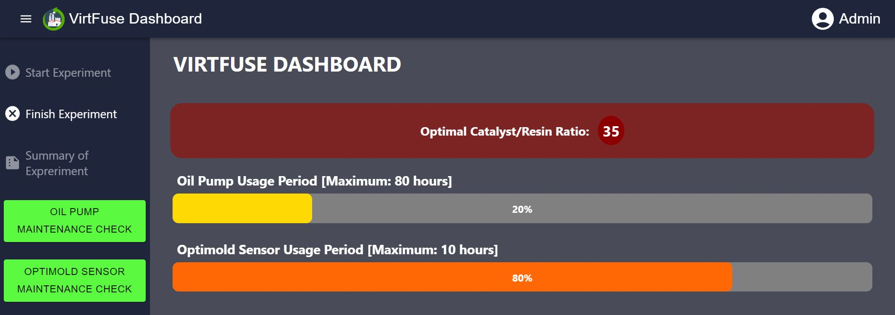

# VirtFuse Dashboard

## Overview

Welcome to the VirtFuse Dashboard – your comprehensive solution for real-time visualization and monitoring of the vacuum infusion process within the scope of the industry. This document will guide you through the key features, installation steps, and usage of the VirtFuse Dashboard.

## Project Description

The VirtFuse –**Smart circular-compliant Vacuum infusion in Industry 4.0: Mixed cloud-edge digital twin model of vacuum infusion in next generation of manufacturing companies**- is a project within the KYKLOS4.0 Funded Experiments initiative, focusing on digital manufacturing and augmented reality (AR) applications in the manufacturing industry.  
The key objective of VirtFuse is to develop a dashboard that visualizes multidimensional data related to the vacuum infusion process in real-time. This dashboard provides essential information to the responsible operator, allowing them to monitor various aspects of the process, including the spread, curing level, and potential defects.  

<div align="center">
  
</div>

## Key Features

- **Real-Time Visualization:** The VirtFuse Dashboard offers dynamic, real-time visualization of multifaceted data concerning the vacuum infusion process, with an exceptional data presentation delay of under one second. Users have the ability to actively monitor critical factors such as the best catalyst/resin ratio, the sensors usage period, room temperature, and curing level.

- **User-Friendly Interface:** The dashboard features an intuitive and user-friendly interface designed for operators at all levels of expertise. Seamlessly navigate through various metrics and visualizations to gain insights effortlessly.

- **Visualization Tools:** We used Echarts which is a powerful visualization tool, especially for working with real-time data. ECharts offers a rich assortment of chart types, facilitates customizations, and excels in rendering data with interactive fluidity. Its cross-platform compatibility and efficient memory usage further solidify its role as a powerful visualization tool.

- **...**

## Project Outline

This project is implemented with Docker. It consists of four services, all of which are running with Docker Compose. A detailed explanation of the services is provided below:

1. **Frontend:** React.js is used as the frontend framework and Material UI is used for the UI component. Frontend doesn't have direct access to the Flask backend for security reasons. Instead, it connects to the Node backend and any data required for visualization will be provided by the Node backend.

2. **Node Backend:** It has a connection to the Flask Backend to trigger the start and stop of the experiments. Also, it has access to MongoDB to read the updated data every second and provide it to the frontend.

3. **Flask Backend:** Flask backend is used to connect to the sensors, get the data and process them to store in the MongoDB. Also, it will keep the necessary information on each experiment in MongoDB.

4. **MongoDB:** MongoDB is a good option for working with real-time and historical data due to its unique features and capabilities. There are databases defined for the users and the experiments. We also keep the information on each experiment in separate collections in order to organize and isolate the data associated with each experiment.


## Installation

To set up the VirtFuse Dashboard, follow these steps:

1. **Prerequisites:** Make sure you've got the necessary hardware and software infrastructure for Docker installation.

2. **Dependencies:** You simply need to have Docker and docker-compose installed on your system.

3. **Configuration:** The project requires some configuration settings. Create a .env file in the root directory of the project and add the following environment variables:
```
MONGO_USERNAME=admin_username
MONGO_PASSWORD=admin_password
```

3. **Running the Application:** First, you need to clone the repository to your local machine and navigate to the project directory.

```
git clone https://github.com/iThermAI/VirtFuse.git
cd VirtFuse
```

Now, build and run the Docker containers using docker-compose.

```
docker-compose up --build -d
```

4. **Database Configuration:** Once the application is up and running, it's time to connect to the MongoDB container and set up your preferred user accounts. For security reasons, we've disabled the signup capability. You can add admin users as well as non-administrative ones, consider that you must define one admin user at least. For creating users you need to connect to the database using the following command with the username and password defined in the env file.

```
 docker exec -it mongodb mongosh -u admin_username -p admin_password
```

Then you have to create a specific database and collection with the precise names mentioned below, and then proceed to add your desired users to it.

```
use users
db.createCollection('userinfos')
db.userinfos.insertOne({
  email: "emailAddress",
  password: "password",
  admin: true
})
```

## Usage

Once the VirtFuse Dashboard is up and running, here's how to make the most of it:

1. **Login:** Access the dashboard using your credentials. The login screen ensures secure access to authorized users only.

2. **Start the Experiment:** After logging in, you can easily navigate to the dashboard page. The initial step is to press the 'Start' button, which will display the optimal catalyst/resin ratio derived from previous experiments. Once this is shown, you can proceed to the real-time dashboard.

2. **Real-Time Monitoring:** You can explore the real-time visualizations of the vacuum infusion process: monitor RGB and thermal images captured by sensors, observe instant room temperature, access area charts for both room temperature and curing level, and oversee the usage periods of the oil pump and optimold sensor for timely maintenance.

3. **Finish the Experiment:** After completing the experiment, simply press the 'Finish' button to proceed to the summary page. From there, you'll gain access to comprehensive data from the entire experiment. One of the crucial pieces of information available is the final score of infusion, which is the result of the deep learning model. This score provides valuable insights and evaluation of the model's performance.




## Contact

For any inquiries, issues, or feedback related to the VirtFuse Dashboard, you can contact [support@ithermai.com](mailto:support@ithermai.com).